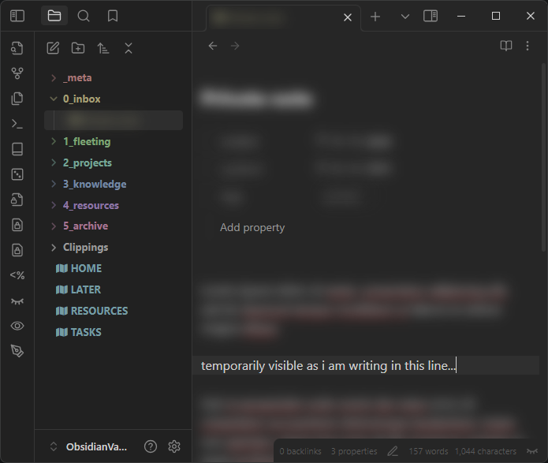
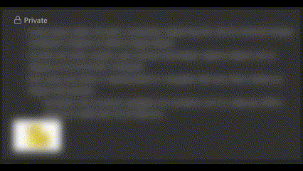

# Private Mode
Simple #private mode for [Obsidian](https://obsidian.md/).

All files, links and search results tagged with #private will get a blurred out in the default mode. You have to either hover over or focus on the element to show it temporarily or use the command "Reveal all" to always show it. 

**This plugin requires the obsidian plugin [Supercharged Links](https://github.com/mdelobelle/obsidian_supercharged_links) to work**


*Basic editor view showcasing all the different elements that get blurred (colorful file explorer is custom made and doesn't come with this plugin)*


*There is also a callout you can use*

# Features
* Supported on Obsidian Mobile
* Ribbon Items and Commands to set visibility (also usable on mobile)
* Status bar indicator that shows the current state and can be clicked to toggle visibility
* New callout `private`, which is also blurred and can be collapsed via default Obsidian behaviour for even more "hidden-ness"
  ```markdown
  > [!private]- Optional Title
  > some text here:
  > - list
  ```

# Installing
The plugin is not available on the community page, as its mostly for me personally, so to install it:

1. Install [Supercharged Links](https://github.com/mdelobelle/obsidian_supercharged_links) via the Settings Panel "Community Plugins"
2. Go into your Obsidian Vaults plugin folder `.obsidian/plugins`
3. Copy the files from the latest release in there
4. (Optional) Adjust the `styles.scss`/`styles.css` to your liking
   * to compile the scss you can use sass `npm install -g sass` and `sass styles.scss styles.css`
5. Enable the plugin in your Obsidian in the Settings panel "Community Plugins"

# Credits
Huge thanks to [Privacy Glasses](https://github.com/jillalberts/privacy-glasses/tree/master) for the groundwork and being licensed under MIT. Use that plugin if you want a more in depth configuration. I personally didn't need or want that much customization and overhead in my plugin. Also i found the "flickering" when opening any file to be too distracting, so i created a simpler version for myself.
