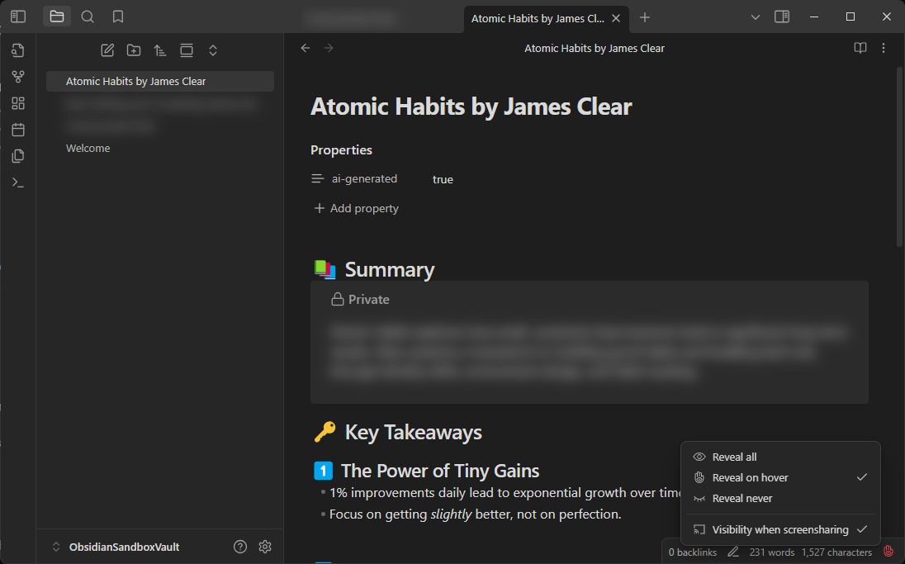

# Private Mode
Simple #private mode for [Obsidian](https://obsidian.md/). All files, links and search results tagged with #private will get blurred out in the default mode. You have to either hover over or focus on the element to show it temporarily or use the command "Reveal all" to always show it. 

**This plugin requires the obsidian plugin [Supercharged Links](https://github.com/mdelobelle/obsidian_supercharged_links) to work**




# Features
* 3️⃣ Three Modes
  * Reveal all: to disable the blurring completely
  * Reveal on hover: only show #private content on hover (default)
  * Reveal never: only show #private content for the currently editing line
* 💻 By default not visible when using screenshare! Keep your secrets :) (desktop-only)
* 📱 Supported on Obsidian Mobile
* 🎀 Commands to set visibility (also usable on mobile)
* ✅ Status bar indicator that shows the current state (desktop-only)
  * left click to cycle visibility
  * right click to open the menu
  * red means recording and obsidian will be visible in screensharing
* ⌨️ Recommended keyboard shortcuts (not set by default)
  * ALT-L to cycle visibility
  * ALT-SHIFT-L to cycle screen share protection
* 💬 Callout `private`, which is also blurred and can be collapsed via default Obsidian behaviour for even more "hidden-ness"
  ```markdown
  > [!private]- Optional Title
  > some text here:
  > - list
  ```

# Installing
The plugin is not available on the community page, as its mostly for me personally, so to install it:

1. Install [Supercharged Links](https://github.com/mdelobelle/obsidian_supercharged_links) via the Settings Panel "Community Plugins"
2. Install [Private Mode](https://obsidian.md/plugins?id=private-mode) via the Settings Panel "Community Plugins"
3. (Optional) Adjust the `styles.scss`/`styles.css` to your liking
   * to compile the scss you can use sass `npm install -g sass` and `sass styles.scss styles.css`
4. Enable the two plugins in your Obsidian in the Settings panel "Community Plugins"

# Credits
Huge thanks to [Privacy Glasses](https://github.com/jillalberts/privacy-glasses/tree/master) for the groundwork and being licensed under MIT. Use that plugin if you want a more in depth configuration. I personally didn't need or want that much customization and overhead in my plugin. Also i found the "flickering" when opening any file to be too distracting, so i created a simpler version for myself.
